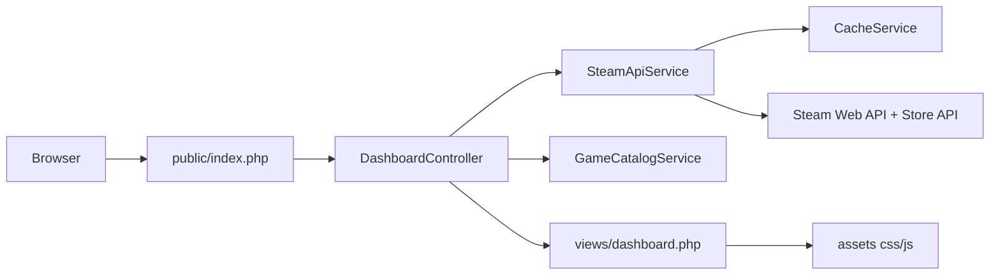

# Steam Library Explorer

Aplicação em PHP para análise de bibliotecas Steam, com foco em integração de APIs, performance e experiência de navegação.


## Visão Geral

O sistema consulta um usuário da Steam, agrega dados públicos de perfil e catálogo, aplica enriquecimento com dados de loja e entrega uma visualização filtrável para exploração rápida.

Você informa um usuário da Steam e o sistema retorna:

- perfil público com avatar, país e data de criação da conta;
- biblioteca de jogos com capa, descrição, preço e conquistas;
- estatísticas gerais como horas totais e valor estimado da biblioteca;
- ordenação dinâmica e paginação.

## Principais Entregas

- integração entre Steam Web API e Steam Store API;
- tratamento de exceções e fallback para chamadas externas;
- cache local em arquivo para reduzir latência em consultas recorrentes;
- ordenação por preço, data e tempo jogado com normalização de dados;
- filtros combinados para recorte de biblioteca;
- interface responsiva com navegação orientada a leitura rápida.

## Recursos Implementados

- modo demo para validação rápida da interface;
- filtros por status de jogo (jogados/não jogados), preço e conquistas;
- indicador de origem dos dados (cache local ou Steam API em tempo real);
- faixa de KPIs com tempo de resposta, origem da consulta e volume de jogos;
- métricas acumuladas por sessão (média de latência e taxa de cache hit);
- botão para copiar URL com filtros e compartilhar exatamente a mesma visão;
- alternância de tema claro/escuro com persistência local;
- estado vazio amigável quando filtros não retornam jogos.

## Demonstração

- Recomendado para portfólio: incluir um GIF curto de 10-15 segundos com o fluxo `buscar perfil -> aplicar filtros -> copiar URL`.
- Caminho sugerido para versionar mídia no projeto: `docs/demo/`.
- Captura sugerida: OBS Studio ou ShareX em 1280x720, 24fps.

## Arquitetura



## Stack

- PHP 8+
- Composer
- GuzzleHTTP
- vlucas/phpdotenv
- HTML/CSS (responsivo)

## Endpoints Utilizados

- ISteamUser/ResolveVanityURL
- ISteamUser/GetPlayerSummaries
- IPlayerService/GetOwnedGames
- ISteamUserStats/GetPlayerAchievements
- ISteamUserStats/GetSchemaForGame
- store.steampowered.com/api/appdetails

## Como Rodar Localmente

1. Clone o repositório

```bash
git clone https://github.com/AndersonC96/Steam_games.git
cd Steam_games
```

2. Instale as dependências

```bash
composer install
```

3. Configure o arquivo .env

```dotenv
STEAM_API_KEY=sua_steam_api_key
STEAM_USERNAME=seu_usuario_padrao
```

4. Suba o servidor local

```bash
php -S localhost:8000
```

5. Acesse no navegador

http://localhost:8000

## Estrutura do Projeto

```bash
.
├── public/
│   └── index.php
│   └── assets/
│       ├── css/dashboard.css
│       └── js/dashboard.js
├── src/
│   ├── Controllers/
│   │   └── DashboardController.php
│   ├── Services/
│   │   ├── CacheService.php
│   │   ├── GameCatalogService.php
│   │   └── SteamApiService.php
│   └── Support/
│       └── TextHelper.php
├── views/
│   └── dashboard.php
├── bootstrap/
│   └── app.php
├── config/
│   └── app.php
├── index.php
├── composer.json
├── .env
├── cache/
├── img/
├── tests/
│   ├── Unit/
│   └── run.php
└── vendor/
```

Observação: [index.php](index.php) foi mantido como entrypoint compatível e delega para [public/index.php](public/index.php).

## Testes

Execute a suíte de testes unitários leves:

```bash
php tests/run.php
```

## Próximos passos

- cache por jogo para reduzir chamadas ao endpoint de detalhes;
- filtros adicionais por faixa de preço e quantidade de conquistas;
- versão com autenticação OAuth da Steam para recursos privados;
- testes automatizados para funções de parsing e ordenação.